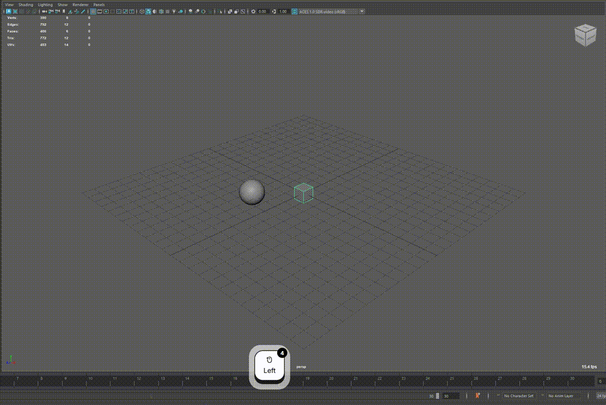
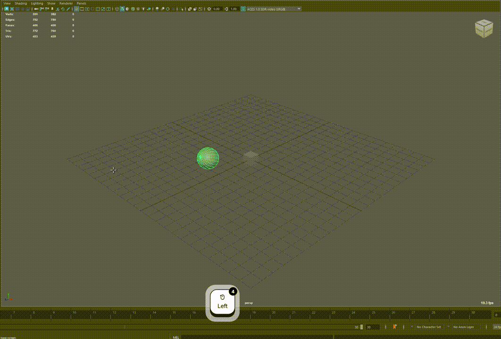
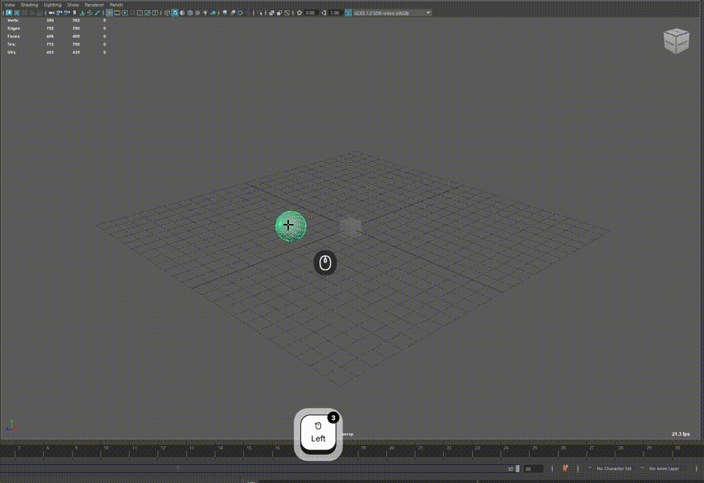

# VAM

**Vim-like Animation Manipulator** — a Maya plugin that brings a modal, keyboard-driven workflow to animation and rig manipulation, inspired by Vim and Blender.

## Overview

VAM adds a custom Maya viewport tool (`vam`) with its own hotkey context. Instead of relying on Maya’s default transform gizmos alone, you work in explicit modes (translate, rotate, scale, register picking, and more) and switch between them with single-key shortcuts—similar to how Vim uses modes and commands.

Activate the tool in Maya:

Click the "vam" icon in the tool shelf to activate vam.

Press `Esc` to leave VAM and return to Maya’s select tool. Default shortcuts below come from `configs/default_profile.json` and can be remapped there.

## Main features

### Modal transformation

Enter a dedicated translate, rotate, or scale mode (`w` / `e` / `r` in the default profile). While in that mode, drag in the viewport to manipulate the selection; axis and coordinate-space constraints can be cycled with number keys. Confirm with a click or return to normal with `q`. The viewport camera stays locked during a modal session so framing stays stable while you edit.

### Registers

Vim-style registers store object selections under single-letter keys.

- **Assign** — `Ctrl+R`, then press a letter to save the current selection to that register.
- **Recall (replace)** — `Ctrl+T`, then press a letter to select everything in that register.
- **Recall (add)** — `Ctrl+Shift+T`, then press a letter to add the register’s objects to the selection.
- **Recall (remove)** — `Ctrl+Alt+T`, then press a letter to deselect objects that are in that register.

### Copy / paste transforms

Copy and paste world-space transform values between objects (one source object at a time for copy).

- **Copy** — `Ctrl+C` enters copy mode; press `w`, `e`, `r`, or `a` to store translate, rotate, scale, or all channels from the selected object.
- **Paste** — `Ctrl+V` applies the buffered channels to the current selection.

## Status

Early development. APIs, bindings, and behavior may change.

## License

See [LICENSE](LICENSE).
